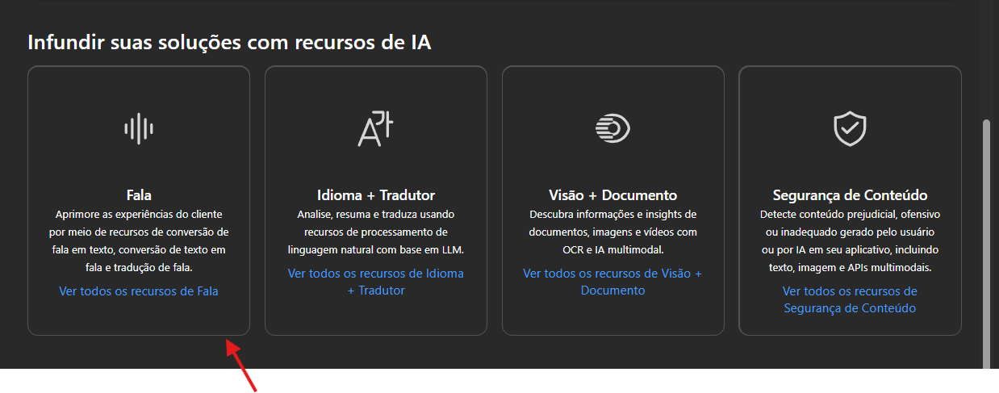

# Criando Projeto com Azure AI Foundry Portal

No navegador vá até este link - [https://ai.azure.com/?azure-portal=true](https://ai.azure.com/?azure-portal=true)

Na página click em criar um projeto.

Deixe tudo como está e click em criar.&#x20;

No menu lateral vá até Serviços de IA.

Na página selecione está caixa.

<figure><figcaption></figcaption></figure>

Vamos explorar Speech to Text

<figure><figcaption><p>Selecione esta caixa.</p></figcaption></figure>

<figure><figcaption></figcaption></figure>

Nesta etapa você pode selecionar o idioma a ser transcrito.

carregar arquivos de audio ou gravar através de um microfone.

<figure><figcaption></figcaption></figure>


Extraindo Informações.

<figure><figcaption><p>Selecione Linguagem</p></figcaption></figure>

<figure><figcaption><p>Selecione Extrair entidades nomeadas</p></figcaption></figure>

Somente para testes copie este texto.

```
 Tired hotel with poor service
 The Royal Hotel, London, United Kingdom
 5/6/2018
 This is an old hotel (has been around since 1950's) and the room furnishings are average - becoming a bit old now and require changing. The internet didn't work and had to come to one of their office rooms to check in for my flight home. The website says it's close to the British Museum, but it's too far to walk.
```

Click em executar e veja a saida.

<figure><figcaption></figcaption></figure>

Você pode extrair frases chaves, sumarizar texto e muito mais apenas escolhendo as caixas abaixo.

<figure><figcaption></figcaption></figure>

Se você terminou os seus testes não esqueça de apagar algum recurso que você não precisa, para evitar custos não necessários.
