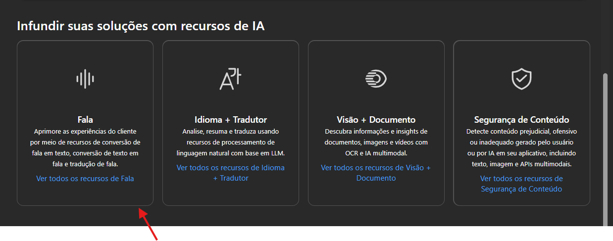

# Instância Banco de dados Azure

1 - Pré-requisitos :

* Uma assinatura do azure, pode ser gratuita.
* Módulo Az.SQL.

2 - Criando a instância.

* Entre no portal da Azure - [https://portal.azure.com/](https://portal.azure.com/)
* Na barra de pesquisa digite sql do azure e clique na primeira opção da lista.

<figure><figcaption></figcaption></figure>

3 - Na próxima tela selecione o botão criar.

4 - Selecione Instância única e clique no botão criar.

<figure><figcaption></figcaption></figure>

5 - A tabela a seguir fornece detalhes para as informações necessárias na guia **Básico**:

<figure><figcaption></figcaption></figure>

6 - Em **Detalhes da instância gerenciada**, selecione **Configurar instância gerenciada** na seção **Computação + armazenamento** para abrir a página **Computação + armazenamento**.

<figure><figcaption></figcaption></figure>

* A tabela a seguir fornece recomendações para a computação e o armazenamento para sua instância gerenciada SQL de exemplo:

<figure><figcaption></figcaption></figure>

* Após configurar clicar em aplicar e salvar suas configurações e voltar para a página de criação da instância.

7 - Clicar na aba Rede.

* As informações da aba rede são opcionais.

8 - Aba Segurança.

* Deixe os valores padrões para o caso deste tutorial.

9 -Aba Configurações adicionais.

* Deixe os valores padrões para o caso deste tutorial.

10 - Rótulos.

* Caso você queira adicionar marcas aos recursos, elas ajudam a organizar seus recursos.

11-  Revisar e criar.

* Examine as suas escolhas e caso esteja tudo correto clique em criar.

### Criar banco de dados :  

1 - Acesse a instãncia criada.

2 - Na página Visão geral, clique em Novo banco de dados.

3 - Digite nome para o banco.

4 - Selecione a aba Revisar e criar , caso esteja tudo correto clique em criar.
